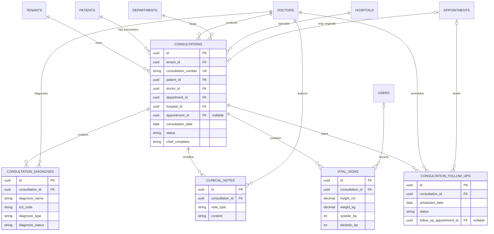
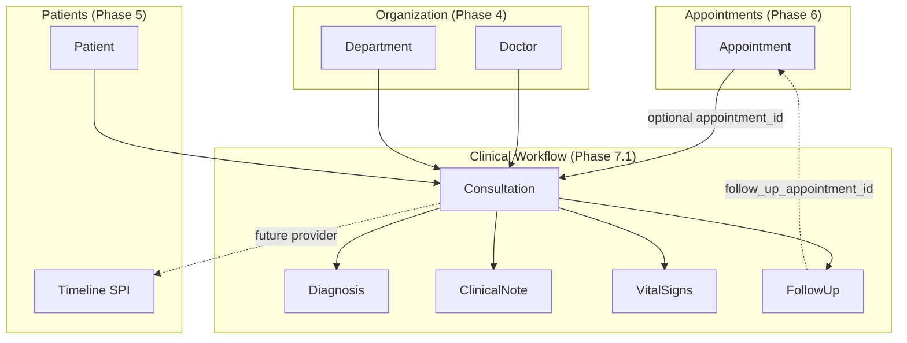
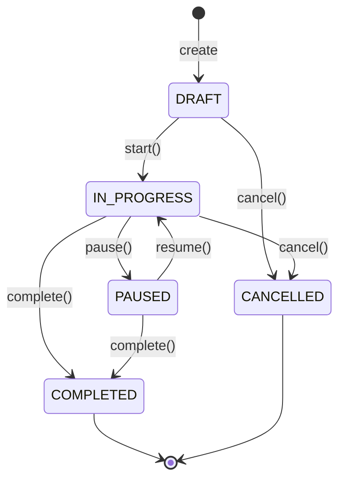

# CLINICAL_WORKFLOW.md

# Clinical Workflow Module

**Phase:** 7.1–7.10 (+ Phase 9 Rx printable/history on `prescriptions`)  
**Packages:** `com.healthcare.hms.clinical`, `com.healthcare.hms.prescriptions`, `com.healthcare.hms.common.storage`  
**Flyway:** `V33`–`V38` (Rx schema V35; Phase 9 is UX/lifecycle — no new migration)  
**Status:** Production-ready through Phase 7.10; Phase 9 prescription DoD closed (printable + history + manage gates). Design: this document + [PATIENT_MANAGEMENT.md](./PATIENT_MANAGEMENT.md) timeline SPI.

---

## 1. Purpose

Digitize doctor consultations as structured clinical encounters. Every consultation produces a
tenant-isolated record linked to a **Patient**, **Doctor**, and optionally an **Appointment**,
with child data for diagnoses, SOAP-aligned notes, vital signs, and follow-up plans.

This module is the encounter layer between Appointment Management (Phase 6) and Prescription
Management (Phase 9). Patient longitudinal history (Phase 5.3) remains separate — consultation
diagnoses capture the *encounter assertion*, not the full chronic disease registry.

---

## 2. Aggregate design

| Entity | Table | Role |
| ------ | ----- | ---- |
| `Consultation` | `consultations` | Aggregate root — encounter lifecycle |
| `Diagnosis` | `consultation_diagnoses` | Structured ICD-capable diagnoses per encounter |
| `ClinicalNote` | `clinical_notes` | SOAP-typed bounded clinical documentation |
| `VitalSigns` | `vital_signs` | Typed numeric vitals (time-series per patient) |
| `FollowUp` | `consultation_follow_ups` | Planned return visits with optional appointment link |

All tables include: UUID PK, `tenant_id`, audit fields (`created_at`, `updated_at`, `created_by`, `updated_by`), soft delete (`deleted`, `deleted_at`, `deleted_by`), and optimistic locking (`version`).

---

## 3. Entity relationship diagram



---

## 4. Module interaction diagram



---

## 5. Consultation lifecycle



| Status | Meaning |
| ------ | ------- |
| `DRAFT` | Created, pre-charting |
| `IN_PROGRESS` | Active encounter |
| `PAUSED` | Temporarily suspended |
| `COMPLETED` | Closed chart (read-only unless amended in later phase) |
| `CANCELLED` | Voided encounter |

---

## 6. Enums

| Enum | Values | Used by |
| ---- | ------ | ------- |
| `ConsultationStatus` | DRAFT, IN_PROGRESS, COMPLETED, CANCELLED | Consultation |
| `DiagnosisType` | PRIMARY, SECONDARY, DIFFERENTIAL | Diagnosis |
| `DiagnosisStatus` | PROVISIONAL, CONFIRMED, RULED_OUT, RESOLVED | Diagnosis |
| `DiagnosisSeverity` | MILD, MODERATE, SEVERE, CRITICAL, UNKNOWN | Diagnosis |
| `ClinicalNoteType` | SUBJECTIVE, OBJECTIVE, ASSESSMENT, PLAN, PROGRESS, PROCEDURE, DISCHARGE, ADVICE, GENERAL | ClinicalNote |
| `FollowUpStatus` | PENDING, SCHEDULED, COMPLETED, CANCELLED, MISSED | FollowUp |
| `FollowUpPriority` | ROUTINE, URGENT | FollowUp |

---

## 7. Package structure

```
com.healthcare.hms.clinical/
├── package-info.java
├── entity/
│   ├── Consultation.java       # Aggregate root
│   ├── Diagnosis.java
│   ├── ClinicalNote.java
│   ├── VitalSigns.java
│   └── FollowUp.java
├── enums/
│   ├── ConsultationStatus.java
│   ├── DiagnosisType.java
│   ├── DiagnosisStatus.java
│   ├── DiagnosisSeverity.java
│   ├── ClinicalNoteType.java
│   ├── FollowUpStatus.java
│   └── FollowUpPriority.java
└── repository/
    ├── ConsultationRepository.java
    ├── DiagnosisRepository.java
    ├── ClinicalNoteRepository.java
    ├── VitalSignsRepository.java
    └── FollowUpRepository.java
```

Reserved for later sub-phases (not in 7.1):

```
clinical/
├── controller/     # Phase 7.2+ REST APIs
├── service/        # Encounter orchestration, lifecycle guards
├── dto/            # Request / response DTOs
├── mapper/         # Entity ↔ DTO mapping
├── validation/     # Bean validation + domain rules
├── support/        # Consultation number generator, appointment linker
├── vitals/         # Phase 7.3 vital signs APIs ✅
├── diagnosis/      # Phase 7.4 diagnosis APIs ✅
└── followup/       # Phase 7.4 follow-up APIs ✅
```

---

## 8. Cross-module relationships

| From | To | FK column | Notes |
| ---- | -- | --------- | ----- |
| Consultation | Patient | `patient_id` | Required |
| Consultation | Doctor | `doctor_id` | Required; clinical authorship |
| Consultation | Department | `department_id` | Required |
| Consultation | Hospital | `hospital_id` | Required |
| Consultation | Appointment | `appointment_id` | Optional; unique per tenant when set |
| Diagnosis | Consultation | `consultation_id` | Required |
| Diagnosis | Doctor | `diagnosing_doctor_id` | Required |
| ClinicalNote | Doctor | `author_doctor_id` | Required |
| VitalSigns | User | `recorded_by_user_id` | Optional; nurses may record |
| FollowUp | Appointment | `follow_up_appointment_id` | Optional; set when booked |

All cross-module references are **UUID FKs only** — no JPA `@ManyToOne` across module boundaries.

---

## 9. Indexing strategy

| Pattern | Index |
| ------- | ----- |
| Tenant isolation | `tenant_id` on every table |
| Patient chart history | `(tenant_id, patient_id, consultation_date)` |
| Doctor daily list | `(tenant_id, doctor_id, consultation_date)` |
| Appointment linkage | Unique `(tenant_id, appointment_id)` among live rows |
| Consultation number | Unique `(tenant_id, consultation_number)` among live rows |
| Vitals trends | `(tenant_id, patient_id, recorded_at)` |
| Follow-up due list | `(tenant_id, status, scheduled_date)` |

Soft-delete-aware uniqueness uses generated slot columns (`active_consultation_number_slot`, `active_appointment_slot`) matching the Appointment module pattern.

---

## 10. Constraints and business rules (enforced in later service layer)

1. One live consultation per appointment (when `appointment_id` is set).
2. Consultation number unique per tenant among non-deleted rows.
3. Primary diagnosis: at most one `PRIMARY` type per consultation (service guard).
4. Child entities require parent consultation in the same tenant.
5. Completed consultations are not editable without an explicit amend flow (future).
6. Vitals numeric ranges enforced at DB level (BP, pulse, pain scale).

---

## 11. Out of scope (Phase 7.1–7.2)

- Prescriptions, lab orders, imaging (prescriptions delivered in 7.5; UI in 7.8)
- Amendment / addendum workflow

Diagnosis / vitals / follow-up child-entity APIs delivered in Phases 7.3–7.4. Clinical Workflow UI delivered in Phase 7.8.

### Phase 7.2 API surface

Base path: `/api/v1/consultations` — permissions: `VISIT_READ`, `VISIT_CREATE`, `VISIT_UPDATE`.

| Method | Path | Description |
| ------ | ---- | ----------- |
| POST | `/` | Create consultation (optional `startImmediately`) |
| GET | `/` | Search / list (paginated) |
| GET | `/{id}` | Get consultation (audit VIEW) |
| GET | `/{id}/clinical-summary` | Clinical summary only (audit VIEW) |
| PUT | `/{id}/documentation` | Update chief complaint, HPI, exam, notes, summary, advice |
| PATCH | `/{id}/start` | DRAFT → IN_PROGRESS |
| PATCH | `/{id}/pause` | IN_PROGRESS → PAUSED |
| PATCH | `/{id}/resume` | PAUSED → IN_PROGRESS |
| PATCH | `/{id}/complete` | IN_PROGRESS/PAUSED → COMPLETED |

### Phase 7.3 Vital signs API surface

Consultation-scoped (`/api/v1/consultations/{consultationId}/vital-signs`):

| Method | Path | Description |
| ------ | ---- | ----------- |
| POST | `/` | Append new measurement row |
| GET | `/` | List all readings for consultation (chronological) |
| GET | `/{id}` | Get single measurement (audit VIEW) |
| PUT | `/{id}` | Correct row while consultation editable |
| DELETE | `/{id}` | Soft-delete entered-in-error row |

Patient history (`/api/v1/patients/{patientId}/vital-signs`):

| Method | Path | Description |
| ------ | ---- | ----------- |
| GET | `/` | Paginated cross-consultation time series (newest first) |

Clinical rules: BP requires systolic+diastolic pair with systolic &gt; diastolic; BMI computed server-side; pain scale 0–10 NRS; append-only history for trends.

### Phase 7.4 Diagnosis API surface

Consultation-scoped (`/api/v1/consultations/{consultationId}/diagnoses`):

| Method | Path | Description |
| ------ | ---- | ----------- |
| POST | `/` | Add structured diagnosis row |
| GET | `/` | List diagnoses (sequenceNumber ascending) |
| GET | `/{id}` | Get single diagnosis (audit VIEW) |
| PUT | `/{id}` | Update while consultation editable |
| DELETE | `/{id}` | Soft-delete diagnosis |

Patient history (`/api/v1/patients/{patientId}/diagnoses`):

| Method | Path | Description |
| ------ | ---- | ----------- |
| GET | `/` | Paginated cross-consultation diagnoses (newest diagnosedAt first) |

Clinical rules: at most one `PRIMARY` per consultation; ICD-10 optional validation; `DIFFERENTIAL` = working diagnosis; `CONFIRMED` = final diagnosis; clinical notes redacted in audit snapshots; writes only while consultation is `DRAFT` \| `IN_PROGRESS` \| `PAUSED`.

### Phase 7.4 Follow-up API surface

Consultation-scoped (`/api/v1/consultations/{consultationId}/follow-ups`):

| Method | Path | Description |
| ------ | ---- | ----------- |
| POST | `/` | Plan follow-up visit |
| GET | `/` | List follow-ups (scheduledDate ascending) |
| GET | `/{id}` | Get single follow-up (audit VIEW) |
| PUT | `/{id}` | Update plan/status while consultation editable |
| DELETE | `/{id}` | Soft-delete follow-up |

Patient history (`/api/v1/patients/{patientId}/follow-ups`):

| Method | Path | Description |
| ------ | ---- | ----------- |
| GET | `/` | Paginated follow-up plans (newest scheduledDate first; filter by status/date) |

Clinical rules: scheduled date must not be in the past; `follow_up_appointment_id` must match same tenant/patient/doctor; reason/instructions redacted in audit snapshots.

### Phase 7.5 Prescription API surface

Package: `com.healthcare.hms.prescriptions` — Flyway `V35__prescriptions.sql`.

Permissions: `PRESCRIPTION_READ`, `PRESCRIPTION_CREATE`, `PRESCRIPTION_UPDATE`, `PRESCRIPTION_DELETE`.

Top-level (`/api/v1/prescriptions`):

| Method | Path | Description |
| ------ | ---- | ----------- |
| POST | `/` | Create prescription with medicine lines (optional `issueImmediately`) |
| GET | `/` | Search / list (paginated) |
| GET | `/{id}` | Get prescription + items (audit VIEW) |
| PUT | `/{id}` | Update DRAFT header / replace items |
| PATCH | `/{id}/issue` | DRAFT → ISSUED |
| PATCH | `/{id}/cancel` | Cancel (not when DISPENSED) |
| DELETE | `/{id}` | Soft-delete DRAFT + items |

Consultation / patient:

| Method | Path | Description |
| ------ | ---- | ----------- |
| GET | `/api/v1/consultations/{consultationId}/prescriptions` | List for encounter |
| GET | `/api/v1/patients/{patientId}/prescriptions` | Paginated history (cross-doctor) |

**Line item fields:** medicine name, dosage, frequency, route, duration, instructions, quantity, refills; optional `medicine_id` / `medicine_code` for future catalog/pharmacy.

**Status lifecycle:** `DRAFT` → `ISSUED` → `PARTIALLY_DISPENSED` / `DISPENSED` (pharmacy-ready) | `CANCELLED`.

**Clinical rules:** at least one item on create; case-insensitive duplicate medicine prevention per prescription (unique `medicine_name_key`); line edits only while `DRAFT`; notes redacted in audit snapshots; doctor-scope on writes; patient history scoped by patient; `issue` re-validates the consultation is still prescribable (not cancelled; patient active).

### Phase 9 Prescription Management (printable + history UX)

Closes Phase 9 DoD on top of 7.5/7.8:

| Surface | Detail |
| ------- | ------ |
| Printable Rx | App route `/app/prescriptions/{id}/print` (`PRESCRIPTION_READ`) — browser print layout; Print actions on encounter Rx panel and patient chart history |
| Patient history | Chart tab **Prescriptions** uses `GET /patients/{id}/prescriptions` |
| Manage gates | FE Issue / Cancel / Delete only while consultation `editable`; Cancel for `DRAFT` / `ISSUED` / `PARTIALLY_DISPENSED` |
| Lifecycle | Backend `issue` calls `requirePrescribableConsultation` (aligned with create/update) |

Medicine **name** selection remains free-text with dosage/frequency/duration/route lines (catalog/pharmacy master is out of Phase 9 scope). Email/PDF server endpoints remain future enhancements — printable DoD is met via dedicated print UI.

### Phase 7.6 Clinical notes API surface

Package: `com.healthcare.hms.clinical.notes` — Flyway `V36__clinical_notes_attachments.sql`.  
Storage: `com.healthcare.hms.common.storage` (`ObjectStorageService` — local filesystem or S3/MinIO).

Permissions: `VISIT_READ`, `VISIT_UPDATE`, `VISIT_DELETE`.

Consultation-scoped (`/api/v1/consultations/{consultationId}/clinical-notes`):

| Method | Path | Description |
| ------ | ---- | ----------- |
| POST | `/` | Create note (SOAP / progress / procedure / discharge / …) |
| GET | `/` | List notes (optional `noteType` filter) |
| GET | `/{noteId}` | Get note + attachment metadata (audit VIEW) |
| PUT | `/{noteId}` | Update while consultation editable |
| DELETE | `/{noteId}` | Soft-delete note + attachments |
| POST | `/{noteId}/attachments` | Multipart upload (image/PDF) |
| GET | `/{noteId}/attachments` | List attachment metadata |
| GET | `/{noteId}/attachments/{id}` | Attachment metadata |
| GET | `/{noteId}/attachments/{id}/download` | Stream binary from object storage |
| DELETE | `/{noteId}/attachments/{id}` | Soft-delete + remove object |

Patient history: `GET /api/v1/patients/{patientId}/clinical-notes` (paginated).

**Note types:** `SUBJECTIVE`, `OBJECTIVE`, `ASSESSMENT`, `PLAN` (SOAP), `PROGRESS`, `PROCEDURE`, `DISCHARGE`, `ADVICE`, `GENERAL`.

**Attachments:** JPG/JPEG/PNG/WEBP (≤10MB), PDF (≤25MB); max 20 per note. Only metadata in DB; binaries via `ObjectStorageService`.

**Storage config:** `hms.storage.type=local|s3` — S3 endpoint/path-style enables MinIO. Default local path `./data/object-storage`.

### Phase 7.7 Follow-up management (enhanced)

Builds on Phase 7.4 follow-up CRUD. Flyway `V37__follow_up_management.sql`.

**Fields:** scheduled date/time, priority (`ROUTINE`/`URGENT`), reason, doctor, status, clinical recommendations, patient instructions; reminder-ready (`reminderEnabled`, `reminderLeadDays`, `nextReminderAt`, `reminderStatus`).

Consultation-scoped (existing + status):

| Method | Path | Description |
| ------ | ---- | ----------- |
| PATCH | `/{id}/status` | Status transition (works after consultation completed) |

Optimized APIs (`/api/v1/follow-ups`):

| Method | Path | Description |
| ------ | ---- | ----------- |
| GET | `/` | Search (filters: patient/doctor/status/priority/date, `overdueOnly`, `dueSoonOnly`) |
| GET | `/due` | Doctor worklist — open follow-ups due/overdue (default 14 days) |
| GET | `/{id}` | Direct lookup by id |

**Timeline:** `FollowUpTimelineProvider` emits `FOLLOW_UP`; Phase 7.10 adds `ConsultationTimelineProvider` (`VISIT`) and `PrescriptionTimelineProvider` (`PRESCRIPTION`) — PHI-light summaries; full detail via clinical/Rx APIs.

**Status transitions:** `PENDING` ↔ `SCHEDULED` → `COMPLETED` / `CANCELLED` / `MISSED`. Terminal statuses skip reminders.

**Reminders:** `next_reminder_at` computed as `scheduled_date − lead_days` for future dispatcher integration (appointment-reminder pattern).

### Phase 7.8 Clinical Workflow UI

Frontend feature module: `frontend/src/features/clinical`.

Routes (permission-gated):

| Path | Permission | Screen |
| ---- | ---------- | ------ |
| `/app/clinical` | `VISIT_READ` | Consultation list |
| `/app/clinical/new` | `VISIT_CREATE` | Start consultation |
| `/app/clinical/[id]` | `VISIT_READ` | Consultation workspace |
| `/app/clinical/follow-ups` | `VISIT_READ` | Follow-up worklist / due list |
| `/app/prescriptions/[id]/print` | `PRESCRIPTION_READ` | Printable prescription |

**Workspace tabs:** Chart (documentation) · Vitals · Diagnosis · Prescriptions · Clinical notes · Follow-up · Patient timeline.

**UX:** Responsive doctor workspace; keyboard shortcuts (`Ctrl+S` save chart, `1–7` switch tabs); local auto-save drafts (localStorage) per consultation tab; permission-based rendering via `Can` (`VISIT_*`, `PRESCRIPTION_*`, `PATIENT_READ` for timeline/allergy banner).

**Stack:** Next.js 15 App Router, React 19, TypeScript, TanStack Query, Redux Toolkit (UI filters/tabs), React Hook Form + Zod, shadcn/ui, Framer Motion (tab transitions).

---

## 12. Next sub-phases (roadmap)

| Sub-phase | Scope |
| --------- | ----- |
| 7.2 | Consultation CRUD APIs + lifecycle service ✅ |
| 7.3 | Vital signs APIs + patient history ✅ |
| 7.4 | Diagnosis / follow-up APIs ✅ |
| 7.5 | Prescription APIs (pharmacy-ready) ✅ |
| 7.6 | Clinical notes + attachments + object storage ✅ |
| 7.7 | Follow-up management + timeline + reminder-ready APIs ✅ |
| 7.8 | Clinical Workflow UI ✅ |
| 7.9 | Security review ✅ |
| 7.10 | Production readiness (queue↔chart sync, cancel, VISIT/Rx timeline, V38) ✅ |

### Queue ↔ consultation bridge (Phase 7.10)

OPD queue `start-consultation` calls `ConsultationEncounterGateway` (SPI in `appointments.queue.spi`, implemented in clinical). Creates/starts the consultation in the same transaction, returns `consultationId`, and the UI opens `/app/clinical/{id}`. Completing the consultation completes the linked appointment and any `IN_CONSULTATION` queue entry. Queue complete rejects editable charts (`CONSULTATION_STILL_OPEN`).

---

_Last updated: Phase 7.10 Clinical Workflow production readiness (2026-07)._
