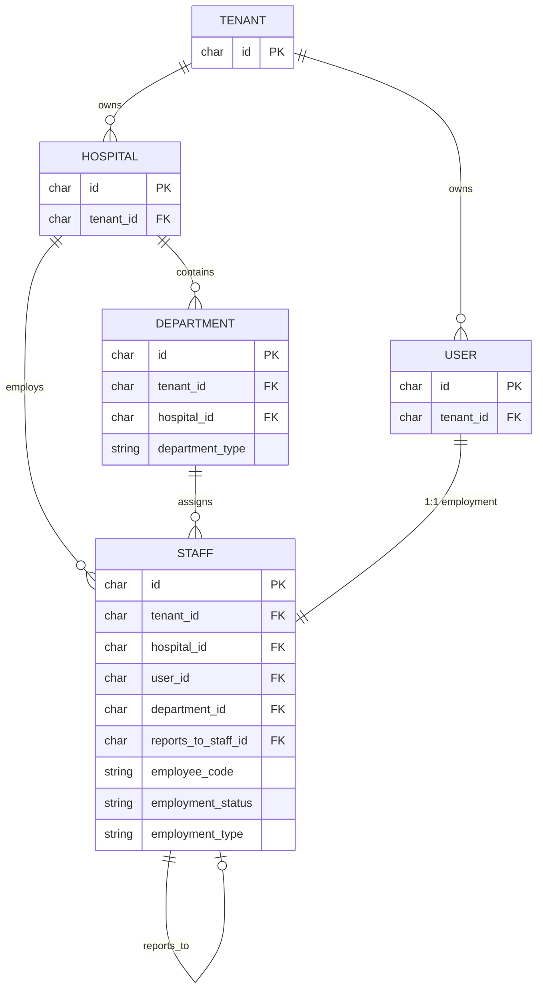
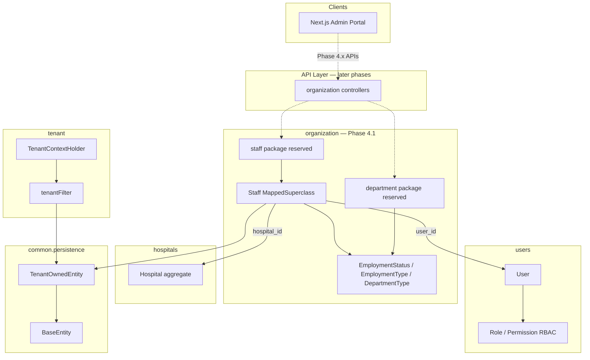

# HOSPITAL_ORGANIZATION.md

# Hospital Administration — Organizational Architecture

**Phase:** 4.1–4.9  
**Status:** 4.1–4.9 Done  
**Module:** `com.healthcare.hms.organization` (+ `users` invitations/management, Hospital Admin UI)

---

## 1. Purpose

Define the Hospital Administration domain foundation for staff employment and
organizational structure, and deliver department management APIs.

Phase 4.1 established:

- Package boundaries
- Base `Staff` abstraction (tenant-aware, auditable, soft-delete, UUID)
- Shared enums: `EmploymentStatus`, `EmploymentType`, `DepartmentType`

Phase 4.2 delivered:

- `Department` entity + CRUD API
- Unique code/name per tenant, soft delete, search/page/sort/filter

Companion sources of truth: [ARCHITECTURE.md](./ARCHITECTURE.md),
[DATABASE.md](./DATABASE.md), [MULTI_TENANCY.md](./MULTI_TENANCY.md),
[API.md](./API.md), [PROJECT_CONTEXT.md](./PROJECT_CONTEXT.md).

---

## 2. Package structure

```
com.healthcare.hms.organization
├── package-info.java
├── controller/DepartmentController.java
├── service/DepartmentService.java
├── service/impl/DepartmentServiceImpl.java
├── repository/DepartmentRepository.java
├── repository/DepartmentSpecifications.java
├── mapper/DepartmentMapper.java
├── dto/request|response/...
├── entity
│   ├── Staff.java                    # @MappedSuperclass employment base
│   └── Department.java               # Phase 4.2
├── enums
│   ├── EmploymentStatus.java
│   ├── EmploymentType.java
│   ├── DepartmentType.java
│   └── DepartmentStatus.java
├── department/                       # documentation anchor
└── staff/                            # RESERVED — Doctor/Nurse/… later
```

### Layer ownership (when APIs land)

Future concrete modules follow ENGINEERING_RULES feature packaging:

```
organization/
├── controller/     # Phase 4.x — not in 4.1
├── service/
├── repository/
├── entity/         # Staff base (4.1); Department + specializations later
├── dto/
├── mapper/
├── validator/
└── exception/
```

---

## 3. Design decisions

| Decision                | Choice                                                  | Why                                                                                                             |
| ----------------------- | ------------------------------------------------------- | --------------------------------------------------------------------------------------------------------------- |
| Module location         | Top-level `organization` (not nested under `hospitals`) | Separates hospital **profile/settings** from **org chart + employment**; `hospitals` stays Phase 2.5/2.6 scoped |
| Staff persistence style | `@MappedSuperclass`                                     | Shared columns without a premature `staff` table; concrete subtypes own tables in 4.2+                          |
| Identity split          | `User` ≠ `Staff`                                        | Auth/RBAC stays in `users`; employment/HR attributes live on `Staff`                                            |
| Department FK           | UUID `departmentId` only (no `@ManyToOne`)              | Avoids inventing Department entity in 4.1 while reserving the column contract                                   |
| Reporting line          | `reportsToStaffId` UUID                                 | Enables hierarchy without self-referencing JPA until concrete tables exist                                      |
| Isolation               | Extend `TenantOwnedEntity`                              | Inherits UUID, audit, soft delete, version, Hibernate `tenantFilter`                                            |

---

## 4. Staff hierarchy (class model)

```
BaseEntity
  └── TenantAwareEntity
        └── TenantOwnedEntity
              └── Staff (@MappedSuperclass)          ← Phase 4.1
                    ├── Doctor                       ← Phase 4.2+ (not created)
                    ├── Nurse                        ← Phase 4.2+ (not created)
                    ├── Receptionist                 ← Phase 4.2+ (not created)
                    ├── LaboratoryTechnician         ← Phase 4.2+ (not created)
                    └── Pharmacist                   ← Phase 4.2+ (not created)
```

### Reporting hierarchy (instance model)

```
Hospital Admin (User + optional Staff root)
        │
        ├── Department Head (Staff.reportsToStaffId → Admin staff)
        │         │
        │         ├── Doctor
        │         └── Nurse
        ├── Receptionist
        └── Laboratory / Pharmacy staff
```

Hospital Admin may remain a `User` with RBAC role only until an administrative
staff profile is required; clinical roles always get a `Staff` subclass row.

---

## 5. Organizational structure (target)

```
Tenant
  └── Hospital (1 default today; multi-hospital later)
        └── Department (typed by DepartmentType)     ← not created in 4.1
              └── Staff specialization
                    └── linked User (auth + roles)
```

`DepartmentType` vocabulary (ready for the future entity):

| Type           | Examples                           |
| -------------- | ---------------------------------- |
| CLINICAL       | Cardiology, Neurology, Orthopedics |
| DIAGNOSTIC     | Laboratory, Radiology              |
| EMERGENCY      | ER / Trauma                        |
| ADMINISTRATIVE | HR, Finance, Ops                   |
| SUPPORT        | Facilities, Logistics              |
| RESEARCH       | Teaching / research units          |
| OTHER          | Tenant-defined                     |

---

## 6. Entity relationships



### Cardinality rules

| Relationship               | Rule                                              |
| -------------------------- | ------------------------------------------------- |
| Tenant → Hospital          | 1 : N (default hospital today)                    |
| Hospital → Department      | 1 : N (future)                                    |
| Hospital → Staff           | 1 : N                                             |
| User → Staff               | 1 : 0..1 per hospital (enforced when tables land) |
| Department → Staff         | 1 : N (optional affiliation)                      |
| Staff → Staff (reports to) | N : 0..1, same tenant                             |

### Shared columns on every organization row

Inherited from `BaseEntity` / `TenantOwnedEntity`:

`id`, `tenant_id`, `created_at`, `updated_at`, `created_by`, `updated_by`,
`deleted`, `deleted_at`, `deleted_by`, `version`

---

## 7. Module interaction diagram



### Interaction rules

1. **organization** may reference `hospitals` and `users` by UUID (and later by service APIs).
2. **organization** must not redefine tenant isolation — always extend `TenantOwnedEntity`.
3. **auth / security** continue to authorize via User roles/permissions; Staff does not replace RBAC.
4. Clinical modules (patients, visits, …) will reference concrete Staff subtypes (e.g. Doctor), never raw User, for clinical authorship.

---

## 8. Enum reference

### EmploymentStatus

`PENDING` → `ACTIVE` → `ON_LEAVE` | `SUSPENDED` → `TERMINATED`  
Soft-delete remains orthogonal (logical removal ≠ termination).

### EmploymentType

`FULL_TIME`, `PART_TIME`, `CONTRACT`, `TEMPORARY`, `INTERN`, `CONSULTANT`

### DepartmentType

`CLINICAL`, `DIAGNOSTIC`, `EMERGENCY`, `ADMINISTRATIVE`, `SUPPORT`, `RESEARCH`, `OTHER`

---

## 9. Explicit non-goals (remaining)

- Org chart UX / frontend assignment screens
- Multi-hospital staff transfers beyond the default hospital

---

## 10. Next phases (suggested)

| Sub-phase | Scope                                       |
| --------- | ------------------------------------------- |
| 4.5+      | Staff UX, scheduling hooks, richer profiles |

---

## 11. Definition of Done

### 4.1

- [x] `com.healthcare.hms.organization` package exists
- [x] `Staff` base abstraction is tenant-aware, auditable, soft-delete, UUID-based
- [x] `EmploymentStatus`, `EmploymentType`, `DepartmentType` defined

### 4.2

- [x] Department entity, DTOs, repository, service, controller, validation
- [x] Flyway migration; unique code/name; soft delete; search/page/sort/filter

### 4.3

- [x] Five staff specialization tables + CRUD APIs

### 4.4

- [x] Assign / transfer staff between departments
- [x] Assign department head (Staff FK + synced user id)
- [x] Prevent duplicate open assignments
- [x] Assignment history + audit + tenant isolation
