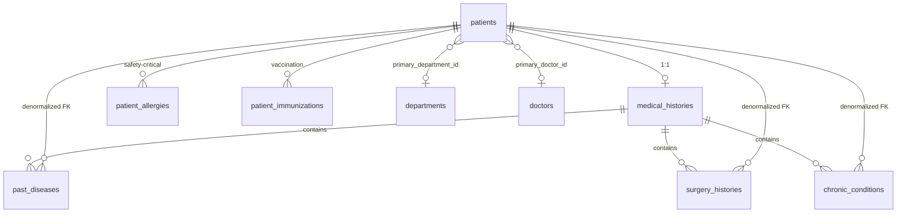

# PATIENT_MANAGEMENT.md

# Patient Management — Domain Architecture

**Phase:** 5.1–5.10 + Phase 8 Medical Records  
**Status:** Done — registration, history (incl. family history), allergies, immunizations, timeline, search, UI, security/production hardening  
**Module:** `com.healthcare.hms.patients` / frontend `features/patients`

---

## 1. Purpose

Define the Patient aggregate root for multi-tenant registration demographics
and identifiers, expose registration / lifecycle APIs, and maintain structured
longitudinal medical history (past diseases, surgeries, chronic conditions,
**family history**).

Clinical encounters (visits/consultations) live in Phase 7 (`clinical` module).
Allergies (Phase 5.4), immunizations (Phase 5.5), and timeline (Phase 5.6 + SPI
providers for visits/Rx/follow-up) complete the longitudinal chart surface.

Companion sources of truth: [ARCHITECTURE.md](./ARCHITECTURE.md),
[DATABASE.md](./DATABASE.md), [API.md](./API.md),
[MULTI_TENANCY.md](./MULTI_TENANCY.md),
[PROJECT_CONTEXT.md](./PROJECT_CONTEXT.md), [ROADMAP.md](./ROADMAP.md).

---

## 2. Package structure

```
com.healthcare.hms.patients
├── controller/PatientController
├── service(+impl)/PatientService, PatientQueryService
├── mapper/PatientMapper
├── dto/request|response
├── validation
├── entity/Patient, EmergencyContact
├── enums/PatientStatus, Gender, BloodGroup, MaritalStatus
├── repository/PatientRepository, PatientSpecifications
└── history/                                 # Phase 5.3
    ├── controller/MedicalHistoryController
    ├── service(+impl)/MedicalHistoryService
    ├── mapper/MedicalHistoryMapper
    ├── dto/request|response
    ├── validation/ValidClinicalDateRange
    ├── entity/
    │   ├── MedicalHistory
    │   ├── ClinicalHistoryEntry             # MappedSuperclass
    │   ├── PastDisease
    │   ├── SurgeryHistory
    │   └── ChronicCondition
    ├── enums/ClinicalSeverity, ClinicalConditionStatus,
    │         DiseaseCategory, ProcedureCategory
    └── repository/...
└── allergy/                                 # Phase 5.4
    ├── controller/AllergyController
    ├── service(+impl)/AllergyService
    ├── mapper/AllergyMapper
    ├── dto/request|response
    ├── entity/Allergy
    ├── enums/AllergyType, Severity, Reaction, AllergyStatus
    └── repository/AllergyRepository
└── immunization/                            # Phase 5.5
    ├── controller/ImmunizationController
    ├── service(+impl)/ImmunizationService
    ├── mapper/ImmunizationMapper
    ├── dto/request|response
    ├── validation/ValidImmunizationDateRange
    ├── entity/Immunization
    ├── enums/ImmunizationStatus, VaccineRoute
    └── repository/ImmunizationRepository
└── timeline/                                # Phase 5.6
    ├── controller/TimelineController
    ├── service(+impl)/TimelineService
    ├── spi/TimelineEventProvider
    ├── provider/                            # registration, history, allergy, immunization
    ├── cursor/TimelineCursorCodec
    ├── dto/response/TimelineEventResponse, TimelinePageResponse
    └── enums/TimelineEventType, TimelineSortDirection, TimelineSeverityHint
```

---

## 3. Phase 5.2 APIs (registration)

| Method | Path                               | Permission       | Behavior                         |
| ------ | ---------------------------------- | ---------------- | -------------------------------- |
| `POST` | `/api/v1/patients`                 | `PATIENT_CREATE` | Register (status `ACTIVE`)       |
| `GET`  | `/api/v1/patients/{id}`            | `PATIENT_READ`   | Get by id                        |
| `PUT`  | `/api/v1/patients/{id}`            | `PATIENT_UPDATE` | Update demographics (not status) |
| `POST` | `/api/v1/patients/{id}/deactivate` | `PATIENT_UPDATE` | `ACTIVE` → `INACTIVE`            |
| `POST` | `/api/v1/patients/{id}/reactivate` | `PATIENT_UPDATE` | `INACTIVE` → `ACTIVE`            |

---

## 4. Phase 5.3 APIs (medical history)

Base: `/api/v1/patients/{patientId}/medical-history`

| Method                | Path                              | Permission                          |
| --------------------- | --------------------------------- | ----------------------------------- |
| `GET`                 | `/`                               | `PATIENT_READ`                      |
| `POST`/`PUT`/`DELETE` | `/past-diseases[/{entryId}]`      | `PATIENT_UPDATE` / `PATIENT_DELETE` |
| `POST`/`PUT`/`DELETE` | `/surgeries[/{entryId}]`          | `PATIENT_UPDATE` / `PATIENT_DELETE` |
| `POST`/`PUT`/`DELETE` | `/chronic-conditions[/{entryId}]` | `PATIENT_UPDATE` / `PATIENT_DELETE` |
| `POST`/`PUT`/`DELETE` | `/family-histories[/{entryId}]`   | `PATIENT_UPDATE` / `PATIENT_DELETE` |

`DELETE` is soft-delete only. Medical history root is auto-created on first entry.

### Structured fields (shared)

| Field             | Type            | Notes                                  |
| ----------------- | --------------- | -------------------------------------- |
| `diagnosisDate`   | `LocalDate`     | Required; for surgery = procedure date |
| `recoveryDate`    | `LocalDate`     | Required when status = `RECOVERED`     |
| `severity`        | enum            | `MILD` … `CRITICAL`, `UNKNOWN`         |
| `conditionStatus` | enum            | `ONGOING`, `CONTROLLED`, `RECOVERED`   |
| `clinicalNotes`   | `VARCHAR(1000)` | Bounded — not a free-text blob         |

Type-specific: category enums + optional clinical codes (`diseaseCode` / `procedureCode` / `conditionCode`).
Family history adds `familyRelation` (`MOTHER`, `FATHER`, `SIBLING`, …) — Flyway `V39`.

---

## Phase 8 — Medical Records readiness

Roadmap Phase 8 maps onto this module (no separate `medical-records` package):

| Deliverable | Status |
| ----------- | ------ |
| Disease history | Done (`PastDisease`) |
| Chronic diseases | Done (`ChronicCondition`) |
| Allergies | Done (`Allergy`) |
| Family history | Done (`FamilyHistory`, V39) |
| Surgery history | Done (`SurgeryHistory`) |
| Vaccination history | Done (`Immunization`) |
| Medical timeline | Done (SPI + `FAMILY_HISTORY` events) |

**Critical/High remaining: none** after Phase 8 family-history close-out.

Security / production notes from Phases 5.9–5.10 remain in force (tenant isolation, nested IDOR guards, soft-delete, critical allergy guards, timeline invalidation).

---

## 5. Phase 5.4 APIs (allergies — safety-critical)

Base: `/api/v1/patients/{patientId}/allergies`

| Method       | Path              | Permission       | Purpose                                              |
| ------------ | ----------------- | ---------------- | ---------------------------------------------------- |
| `GET`        | `/`               | `PATIENT_READ`   | List (optional `?type=`)                             |
| `GET`        | `/banner`         | `PATIENT_READ`   | **Patient banner alerts** — call on every chart open |
| `GET`        | `/critical`       | `PATIENT_READ`   | **Critical alerts** only                             |
| `GET`        | `/{allergyId}`    | `PATIENT_READ`   | Get one                                              |
| `POST`/`PUT` | `/[/{allergyId}]` | `PATIENT_UPDATE` | Create / update                                      |
| `DELETE`     | `/{allergyId}`    | `PATIENT_DELETE` | Soft-delete (Hospital Admin+)                        |

### Clinical model (healthcare-domain validated)

| Concern         | Design                                                                |
| --------------- | --------------------------------------------------------------------- |
| Not metadata    | Dedicated banner + critical endpoints so allergies cannot be buried   |
| Structured      | `AllergyType` (DRUG/FOOD/ENVIRONMENTAL), `Severity`, `Reaction` enums |
| Clinical flags  | `verified`, `patientReported`, `criticalAlert`, `showOnBanner`        |
| Auto-escalation | `LIFE_THREATENING` or `ANAPHYLAXIS` → critical + banner               |
| Drug allergies  | Filterable; banner reports `hasActiveDrugAllergies` / NKDA inference  |
| Soft delete     | Logical only; retained for audit                                      |

> **NKDA note:** Banner `noKnownDrugAllergies` means _no active DRUG allergy rows on the chart_.
> An explicit clinician NKDA attestation can be added later if required for compliance workflows.

---

## 6. Phase 5.5 APIs (immunizations)

Base: `/api/v1/patients/{patientId}/immunizations`

| Method       | Path                   | Permission       | Purpose                                        |
| ------------ | ---------------------- | ---------------- | ---------------------------------------------- |
| `GET`        | `/`                    | `PATIENT_READ`   | List (optional `?status=`)                     |
| `GET`        | `/due`                 | `PATIENT_READ`   | Due / overdue next doses (nextDueDate ≤ today) |
| `GET`        | `/{immunizationId}`    | `PATIENT_READ`   | Get one                                        |
| `POST`/`PUT` | `/[/{immunizationId}]` | `PATIENT_UPDATE` | Create / update                                |
| `DELETE`     | `/{immunizationId}`    | `PATIENT_DELETE` | Soft-delete                                    |

### Clinical model

| Field                | Type        | Notes                                                                |
| -------------------- | ----------- | -------------------------------------------------------------------- |
| `vaccineName`        | string      | Required; optional `vaccineCode` (CVX / formulary)                   |
| `doseNumber`         | int 1–50    | Dose in series                                                       |
| `manufacturer`       | string      | Optional                                                             |
| `batchNumber`        | string      | Lot / batch for recall                                               |
| `administrationDate` | `LocalDate` | Required                                                             |
| `nextDueDate`        | `LocalDate` | Optional; must be ≥ administration date                              |
| `healthcareProvider` | string      | Administering clinician / site                                       |
| `route`              | enum        | `INTRAMUSCULAR` … `UNKNOWN`                                          |
| `status`             | enum        | `ADMINISTERED` (default), `SCHEDULED`, `REFUSED`, `ENTERED_IN_ERROR` |

`DELETE` is soft-delete only. Flyway: `V21__patient_immunizations.sql`.

---

## 7. Phase 5.6 APIs (patient timeline)

Base: `/api/v1/patients/{patientId}/timeline`

| Method | Path | Permission     | Purpose                         |
| ------ | ---- | -------------- | ------------------------------- |
| `GET`  | `/`  | `PATIENT_READ` | Cursor-paged chronological feed |

Query params: `types` (multi), `cursor`, `size` (default 20, max 100), `direction` (`DESC` default / `ASC`).

### Design (reviewed)

| Concern        | Decision                                                                                                 |
| -------------- | -------------------------------------------------------------------------------------------------------- |
| Aggregation    | On-read fan-out via `TimelineEventProvider` SPI — **no** materialised timeline table                     |
| Ordering       | Clinical event date (`occurredOn`), then `recordedAt`, then type, then `sourceId`                        |
| Pagination     | Opaque keyset cursor (offset unsuitable for merged feeds)                                                |
| Future modules | `LAB_RESULT` / `BILLING` enum values reserved; empty until providers register |
| Registered timeline | `VISIT` / `PRESCRIPTION` / `FOLLOW_UP` (+ Phase 5 history/allergy/immunization/family) |
| Safety         | Timeline does **not** replace allergy banner / critical APIs                                             |
| Indexes        | Flyway `V22__patient_timeline_indexes.sql` adds allergy `onset_date` / `created_at` indexes              |

### `occurredOn` mapping

| Source                           | Primary date          | Fallback           |
| -------------------------------- | --------------------- | ------------------ |
| Registration                     | `DATE(created_at)`    | —                  |
| Past disease / surgery / chronic | `diagnosis_date`      | —                  |
| Allergy                          | `onset_date`          | `DATE(created_at)` |
| Immunization                     | `administration_date` | —                  |

Default narrative excludes soft-deleted and `ENTERED_IN_ERROR` rows. Immunization refusals remain visible clinical facts.

---

## 8. Phase 5.7 APIs (patient search)

| Method | Path               | Permission     | Behavior                   |
| ------ | ------------------ | -------------- | -------------------------- |
| `GET`  | `/api/v1/patients` | `PATIENT_READ` | Paginated directory search |

### Filters (all applied in SQL via `PatientSpecifications`)

| Param                                                                   | Notes                                                                                   |
| ----------------------------------------------------------------------- | --------------------------------------------------------------------------------------- |
| `q`                                                                     | Free-text OR across MRN (prefix), name (contains), phone (prefix), email, CNIC (prefix) |
| `mrn`, `firstName`, `lastName`, `phone`, `email`, `nationalId` / `cnic` | Dedicated field filters                                                                 |
| `status`, `bloodGroup`, `gender`                                        | Enum equality                                                                           |
| `dateOfBirth`, `dateOfBirthFrom`, `dateOfBirthTo`                       | Exact / range on indexed DOB                                                            |
| `ageMin`, `ageMax`                                                      | Converted to DOB range predicates (uses `idx_patients_tenant_dob`)                      |
| `departmentId`                                                          | `primary_department_id` (nullable affiliation column)                                   |
| `doctorId`                                                              | `primary_doctor_id` (future-ready; nullable until assignment workflows)                 |

Pagination / sort: Spring `Pageable` (`page`, `size`, `sort`) with whitelist; default `lastName,firstName ASC`; max size 100.

Flyway: `V23__patient_search.sql` (affiliation columns + composite indexes). **No in-memory filtering.**

---

## 9. Phase 5.8 UI (Patient Management)

Frontend feature: `frontend/src/features/patients`.

| Route                     | Permission                 | Surface                                                          |
| ------------------------- | -------------------------- | ---------------------------------------------------------------- |
| `/app/patients`           | `PATIENT_READ`             | Directory list — search, status/gender/blood filters, pagination |
| `/app/patients/new`       | `PATIENT_CREATE` (actions) | Registration form                                                |
| `/app/patients/[id]`      | `PATIENT_READ`             | EMR chart — allergy banner + tabs                                |
| `/app/patients/[id]/edit` | `PATIENT_UPDATE` (actions) | Demographics edit                                                |

Chart tabs: Overview · Medical history · Allergies · Vaccinations · Timeline.

| Concern       | Implementation                                                      |
| ------------- | ------------------------------------------------------------------- |
| Server state  | TanStack Query (`patients`, nested clinical keys)                   |
| List UI state | Redux `patientsUi` slice (q/page/filters/detail tab)                |
| Forms         | React Hook Form + Zod                                               |
| AuthZ UX      | `<Can>` for create/update/lifecycle; routes gated by `PATIENT_READ` |
| Safety        | Allergy banner fetched on every chart open                          |
| Layout        | Responsive EMR chart; shared hospital-admin list chrome             |

Documents upload and a dedicated patient dashboard remain later (5.8+ roadmap remainder).

Security / production hardening (Phases 5.9–5.10) is summarized in this document under Phase 8 readiness — no separate review markdown.
Clinical soft-delete requires `PATIENT_DELETE`. Critical allergy downgrade/deactivation also requires `PATIENT_DELETE`.

---

## 10. Design decisions

| Decision                                | Choice                                            | Why                                                                                  |
| --------------------------------------- | ------------------------------------------------- | ------------------------------------------------------------------------------------ |
| History root                            | `MedicalHistory` 1:1 with patient                 | Chart section without dumping narrative into patient row                             |
| Entry base                              | `ClinicalHistoryEntry` MappedSuperclass           | Shared dates/severity/status/notes without a premature single-table inheritance dump |
| No free-text blobs                      | Enums + codes + bounded notes                     | Searchable, auditable, clinically comparable records                                 |
| Soft delete                             | All history tables                                | Medical data must remain recoverable for audit                                       |
| Audit                                   | Service-layer `AuditLogService` on every mutation | Compliance / who-changed-what                                                        |
| No visits                               | Explicit exclusion                                | Phase 7 owns encounters                                                              |
| Allergies as first-class alerts         | Banner + critical APIs                            | Healthcare-domain: allergies must be impossible to miss                              |
| Immunizations as structured lot records | Dose + manufacturer + batch + next-due            | Recall readiness and series tracking; due API for follow-up                          |
| Provider as free-text                   | `healthcareProvider` string                       | External vaccinators may not be staff users                                          |
| Timeline as read-model                  | Provider SPI + cursor merge                       | Source tables remain SoT; visits/Rx/lab/billing extend without dual writes           |
| Search via Specifications               | DB predicates + page/sort whitelist               | Avoid loading full tenant patient sets into memory                                   |
| Age → DOB conversion                    | SQL date bounds on indexed column                 | Age is derived; never filter age in application memory                               |
| Department / doctor filters             | Nullable `primary_*` FKs                          | Future-ready without requiring visits module yet                                     |

---

## 11. Entity relationships



Timeline is a **read projection** over the clinical tables above (not a persisted entity).

---

## 12. Security notes

- History, allergies, immunizations, timeline summaries, and search hits are PHI — never log full clinical notes.
- Tenant filter enforced via `TenantOwnedEntity`.
- Mutations require `PATIENT_UPDATE` (create/update) or `PATIENT_DELETE` (soft-delete / critical allergy downgrade); reads / search require `PATIENT_READ`.
- Allergy banner/critical endpoints should be called on every patient chart open.
- Immunization `/due` should be consulted when reviewing follow-up / preventive care.
- Timeline is a story view — always fetch banner/critical separately for prescribing safety.
- Search sort properties are whitelisted to prevent injection of arbitrary column names.
